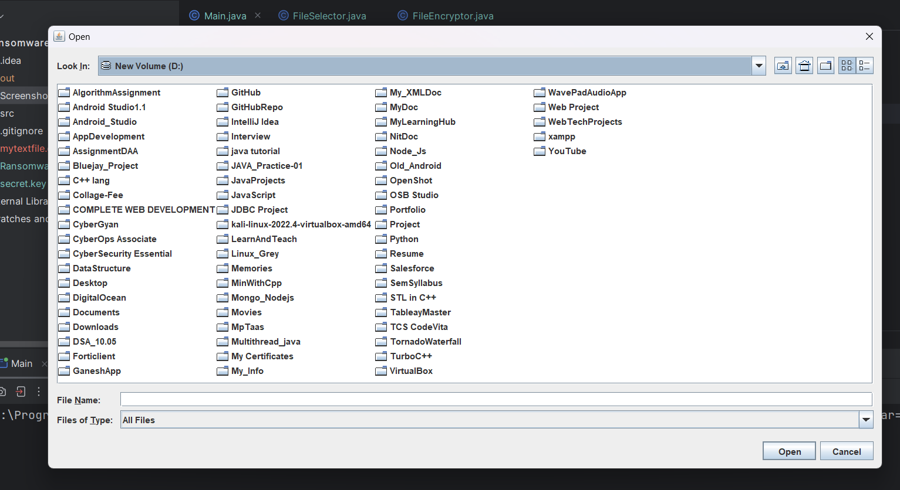
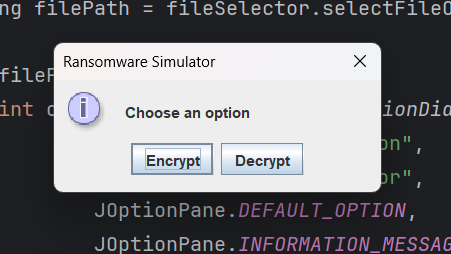
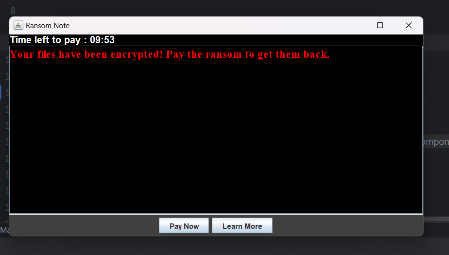

# 🦠 Ransomware Simulator (Educational)

A **Java-based ransomware simulation framework** developed strictly for **educational, research, and defensive cybersecurity training**.  
This project demonstrates how ransomware *operates internally*—including file selection, encryption simulation, key handling, and recovery—inside a **controlled, non-destructive environment**.

---

## ⚠️ DISCLAIMER

🚨 **IMPORTANT NOTICE**

This project is created **ONLY for academic learning, cyber-defense research, and security awareness training**.

❌ It is **NOT** designed for real-world attacks  
❌ It must **NOT** be deployed on production systems  
❌ It must only be used on **test files with explicit permission**

The author and contributors take **no responsibility** for misuse.

---

## 🎯 Project Objectives

- Understand ransomware **workflow and lifecycle**
- Learn **secure encryption concepts**
- Simulate **incident response and recovery**
- Practice **secure Java coding standards**
- Apply **object-oriented and MVC principles**

---

## ✨ Features

✅ Directory-based file selection  
✅ Safe encryption simulation (reversible)  
✅ AES-based cryptography for learning  
✅ Key generation and storage simulation  
✅ Ransom note simulation (console/UI-based)  
✅ Decryption & recovery flow  
✅ Modular and extensible design

---


## Testing Results

The simulator has undergone extensive testing to ensure the following:
- **Successful file encryption and decryption**: All test files were correctly encrypted and could be decrypted using the same key.
- **Proper functionality of the GUI**: The GUI displayed the ransom note as intended and allowed users to interact with the application.
- **Tracking of indicators of compromise (IoCs)**: The application effectively tracked and displayed IoCs related to the simulated ransomware activity, demonstrating the potential impact of such attacks.

---

## 🛠️ Technology Stack

- **Language:** Java (JDK 19+)
- **IDE:** IntelliJ IDEA
- **Database (Optional):** MySQL (simulation only)
- **Crypto API:** `javax.crypto`
- **Build Tool:** Standard Java Project

---

## 📁 Project Structure

```commandline
RansomwareSimulator/
│
├── src/
│ └── ransomware/
│ ├── Main.java
│ ├── controller/
│ │ └── SimulatorController.java
│ ├── crypto/
│ │ └── FileEncryptor.java
│ ├── key/
│ │ └── KeyStorage.java
│ ├── ui/
│ │ └── RansomNote.java
│ └── util/
│ └── FileSelector.java
│
├── screenshots/
├── README.md
├── .gitignore
└── LICENSE
```


---

## ▶️ How It Works (Simulation Flow)

1. User selects a **test directory**
2. System generates a **temporary encryption key**
3. Files are **safely encrypted (educational mode)**
4. A simulated ransom note is displayed
5. Decryption is possible using the stored key

---

## 🔐 Security & Ethics

- Encryption is **reversible**
- Only selected extensions are processed
- No system files are touched
- Designed for **lab environments only**

---

## 📸 Screenshots

| Directory Selection                       | Operations                                   | Ransom Note |
|-------------------------------------------|----------------------------------------------|-------------|
|  |  |  |

---

## 🤝 Contributing

Pull requests are welcome for:
- Defensive improvements
- Better UI
- Logging & monitoring
- Threat detection simulation

---

---
## 🎓 Project Context and Affiliation

This Ransomware Simulator project was developed as a technical contribution during an internship at **C-DAC (Centre for Development of Advanced Computing)**, under the umbrella of the **Cyber Gyan Project**.

The development process strictly adhered to secure coding standards and cyber security best practices, guided by collaboration with senior developers and mentors within the project.

---
## 🙏 Acknowledgments

This project was completed during an internship at **C-DAC** as part of the **Cyber Gyan Project**.

I would like to acknowledge the senior developers and mentors for their guidance, ensuring the development process strictly adhered to:
* Cyber security best practices
* Secure coding standards


## 📝 License

MIT License  
This project is open-source for **educational use only**.
